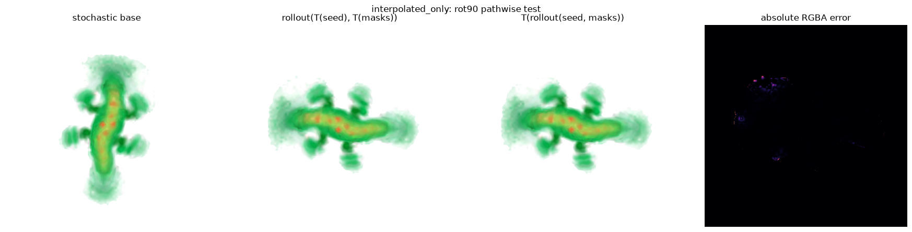
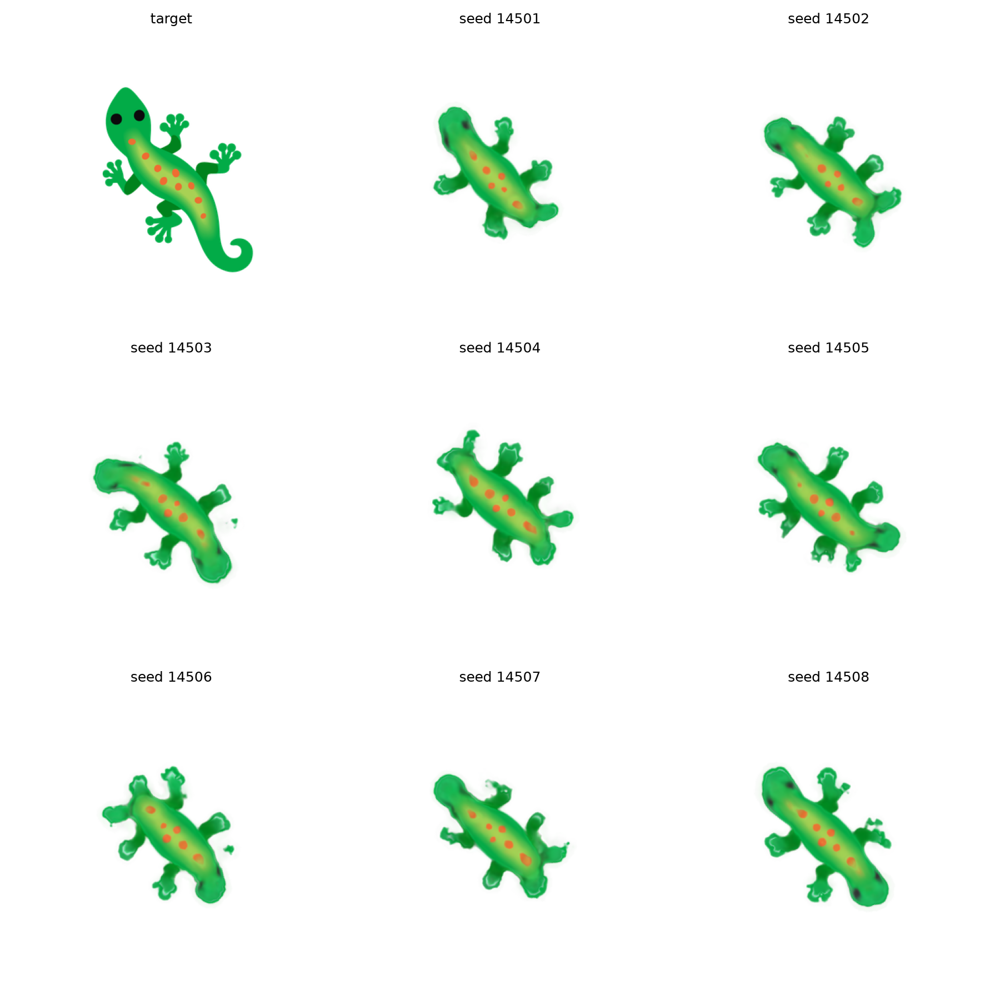
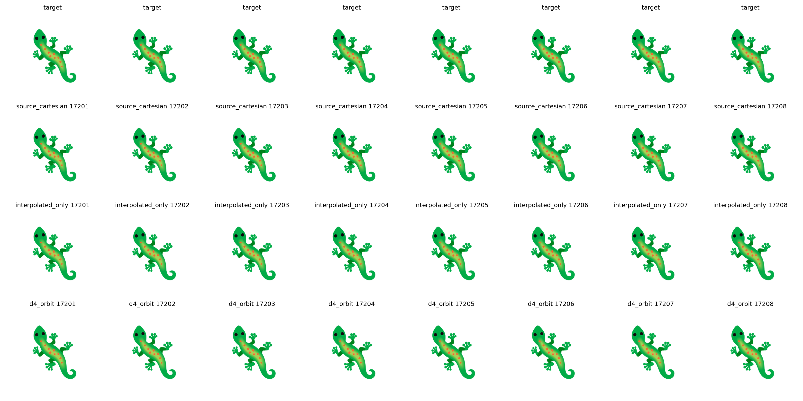
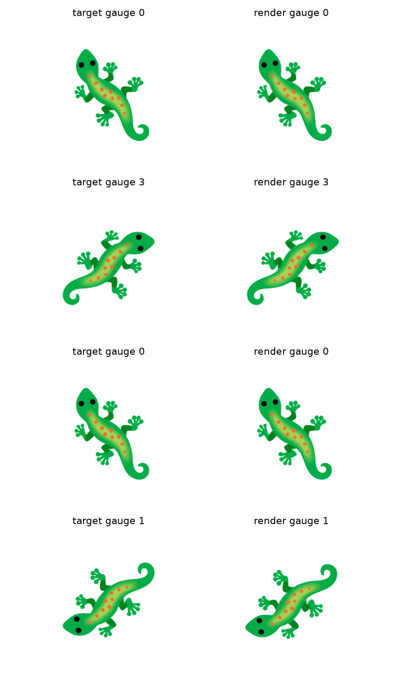
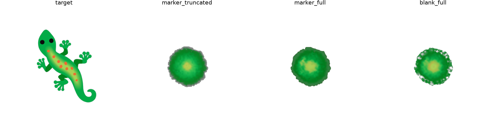

# IsoNCA × LPPN: results report V2

## Research question

Can a Laplacian/gradient-norm IsoNCA grow a sharp lizard through a
coordinate-free Cells2Pixels local pattern producing network (LPPN) while
preserving rotation and reflection symmetry?

**The combined goal was not reached.** The decoder can preserve exact
square-grid rotation/reflection symmetry, and a symmetric decoder can render a
sharp lizard from informative cellular states. The tested learned isotropic
growth rules produced soft lizards or nearly radial shapes. These are results
for exact quarter-turns and reflections (D4); arbitrary-angle isotropy has not
been established.

## Follow-up to the original decoder comparison

The [single-seed direct-output baseline](isonca_isotropic_lppn_experiments_2026-07-23.md)
grew a recognizable lizard with Laplacian/gradient-norm perception and an
invariant FFT loss; the structured-seed example was unreliable in our runs.

The [V1 report](isonca_lppn_results_v1.md) compared four LPPNs trained with
the same `lap_gradnorm` IsoNCA: interpolated state only, Cartesian subcell
coordinates, unordered neighboring states, and unordered neighbors with radial
distance. The coordinate-free variants had decoder-only D4 relative L2 error
near `2e-7`, versus `0.028`–`0.040` for Cartesian coordinates. The unordered
neighbor arm had the best loss statistics in that single-seed comparison, but
none was visibly sharp.

We increased padding from 32 to 128 pixels per side, tested decoder widths
64 and 96, and periodically flushed the training pool. The suggested dense
FFT angle sampling was already present. Each run used one training seed and
the same invariant FFT objective.

| Experiment | Change | Result |
| --- | --- | --- |
| Full resets | Width 64; reset pool, Adam, and cyclic schedule every 10,000 updates | Severe post-reset loss spikes; diffuse outputs. |
| Pool-only resets | Keep optimizer state at pool flush; peak learning rate `3e-4` | Stable, but underfit. |
| Restored learning rate | Raise only the peak learning rate to `1e-3` | Recognizable lizard, still soft. |
| Wider decoder comparison | Restore width 96; compare all four decoders after 50,000 updates | Three recognizable but soft lizards; the unordered-neighbor result was more diffuse. |

The full-reset experiment changed padding, width, and reset behavior together,
so its failure does not isolate one cause. Raising only the learning rate in
the pool-only protocol improved morphology while training remained stable.
The padding increases the canvas from 576×576 to 768×768 around the 512×512
target, with the cellular grid increasing from 72×72 to 96×96. Thus absolute
FFT losses are not directly comparable with V1. Containment over every
stochastic rollout was not audited.

| Width-96 decoder | Fixed-rollout target loss ↓ | Decoder-only D4 relative L2 | Paired-mask render relative L2, maximum |
| --- | ---: | ---: | ---: |
| Interpolated state only | **67.706** | `1.87e-7`–`2.17e-7` | `0.01096` |
| Cartesian coordinates | 90.940 | `0.0378`–`0.0557` | `0.01546` |
| Unordered neighbors | 75.916 | `2.41e-7`–`2.63e-7` | `0.00562` |
| Unordered neighbors + radius | 72.029 | `2.76e-7`–`3.05e-7` | **`0.00500`** |

The decoder test measures `||D(Tz) - T(Dz)||₂ / ||T(Dz)||₂` on one asymmetric
state. The paired-mask test also transforms the seed and each stochastic
update mask before growth. The coordinate-free decoders remained symmetric
to numerical precision, but their learned end-to-end systems had larger
errors. A subsequent audit found that the original radial-neighbor formula
failed D4 at *odd* render scales; corrected radial weighting restored that
property without improving reconstruction. The comparison above used an even scale.

## Where the sharpness gap remained

The subsequent diagnostics kept the 96×96 cellular grid but reduced the
target to 256×256 with 64-pixel padding: a 384×384 render, or four pixels per
cell instead of eight. They tested state representation and growth, beyond
the original decoder comparison.

Directly optimizing a cellular state produced a sharp image; fitting only the
decoder on a frozen state from the trained IsoNCA stayed soft. Training against
aligned target pixels improved shape, but further detail and persistence
supervision did not make fine detail survive cellular updates. The freely
optimized sharp state also lost detail when advanced by the learned rule.

Separate appearance channels allowed sharp images when fitted independently
for each state, but a learned recurrent rule overfit repeated growth histories.
Fresh update masks improved generalization across three repetitions without
recovering sharpness or passing the long-rollout symmetry test. Learning
stable, informative states remained the difficulty.

For the IsoNCA port below, Cells2Pixels spatial/shape/perceptual losses replaced
the FFT-only fitting objective, with additional direct RGBA/auxiliary state
supervision. FFT alignment still selected the target pose. Composite quality
sums RGBA L1/L2, state-alpha shape L1/L2, and RGB perceptual distance (LPIPS);
it cannot be compared numerically with FFT losses. The directional reference
uses a fixed pose; the port selects an aligned target and aligns its displayed
images. Fresh histories use independent update masks; age counts cellular updates.

| System | Mean age-128 composite quality ↓ | Visual result |
| --- | ---: | --- |
| Directional Cells2Pixels reference, eight fresh histories | **0.014569** | Sharp lizard. |
| 50,000-update `lap_gradnorm` IsoNCA port, eight fresh histories | 0.424432 | Recognizable, but soft and incomplete. |
| D4 readout on frozen **directional reference states**, 16 fresh histories | 0.017190 | Sharp; readout D4 maximum absolute error `4.77e-7`. |
| Scalar IsoNCA with that readout, 16 fresh histories | 0.559200 | Nearly radial; paired-path image D4 maximum absolute error `2.12e-4`. |

The directional reference differs in growth rule, capacity (32 state channels
and 256 hidden units versus 16/128 in the port), decoder, precision, and
schedule, so it does not isolate isotropy. The later D4 readout uses a different
architecture: it averages features over eight rotations/reflections of ordered
neighbors and subcell coordinates. It renders sharply **from states grown by
a directional NCA**.
The scalar IsoNCA with matching capacity remained nearly radial at the audited
5,000-update checkpoint of an interrupted run. This table's symmetry errors
are maximum absolute pixel errors, unlike the earlier relative L2 values.

The first panel shows lizards **grown by the learned isotropic rule**; their
head, tail, and fine details are often malformed. Every generated row in the
second panel instead renders **states grown by the directional reference**.
Its rows compare the original Cartesian readout, an interpolated-state readout,
and the symmetric D4 readout on those same directional states. Their sharpness
tests readout capacity, not isotropic growth.

## Orientation experiments and final control

Further controls tested consistent head/tail labels, states carrying vector
or discrete orientation information, longer-range perception, and symmetry
constraints on the sharp directional model. None of the newly trained
isotropic growth rules produced sharp lizards on fresh histories while passing
the tested growth-symmetry checks.

A separate, stronger **conditional** result used a random scalar marker around
a fixed live seed cell to choose one of eight quarter-turn/reflection poses.
Here “conditional” means the marker supplies the orientation for the output.
A cue propagated that choice locally and steered the **frozen directional growth
rule**; the symmetric readout then rendered the corresponding lizard. Across
16 fresh marker and update-mask histories, mean aligned image quality was
`0.017290` and the largest paired-mask D4 image error was `0.001221` maximum
absolute pixel difference. The known even-grid registration shift was applied
when scoring image quality. The panel calls the chosen pose a “gauge.” Removing
the marker spoiled the result, so the cue was functional. This is sharp,
marker-guided growth using an existing directional rule, not a newly learned
Laplacian/gradient-norm IsoNCA.

The final control asked whether a similar marker could instead guide a
**newly trained isotropic rule** toward an elongated lizard. It compared gradients
through all 64 growth steps with gradients through only the last 16, plus a
matched living seed without the marker. Each arm received 150 training updates
on one fixed history. On eight fresh histories, age-64
fixed-pose loss was `0.193774` for the full-history marked arm and `0.193511`
for the blank arm. Removing the marker changed the marked arm's mean fresh
loss by only `0.00814%`. The marked arm's mean
age-64 axis ratio (alpha-weighted major/minor spread) was `1.041`, versus
`2.262` for the target, and its mean age-128 loss rose to `3.775398`.
This one marker, initialization, and training
history did not show useful marker dependence. These fixed-pose losses are
not on the composite-quality scale above.

## Conclusion and limits

The evidence separates into three findings. A coordinate-free LPPN can
be trained jointly with a `lap_gradnorm` IsoNCA while preserving tested
decoder-only D4 symmetry. A sharp D4 readout is feasible on frozen states
from a directional NCA. A random marker can steer that frozen directional
rule toward a sharp lizard in one of eight grid-symmetric poses. None of the
tested newly learned isotropic growth routes produced a sharp, robust,
non-radial lizard.

The early decoder comparisons used one training seed per arm and one
asymmetric decoder probe. Later fresh-history counts are stated above. These
tests cover one target and finite training schedules; they do not rule out
other growth rules. Exact D4 tests do not establish continuous SO(2)
equivariance, and numerical pathwise errors can grow during long stochastic
rollouts.

## Evidence

| Study | Executed record |
| --- | --- |
| Original matched decoder comparison | [V1 report](isonca_lppn_results_v1.md) and [notebooks](../notebooks-executed/v1/) |
| Training controls | [Full resets](../notebooks-executed/v2/reset_trial.ipynb), [pool only](../notebooks-executed/v2/pool_only.ipynb), [restored learning rate](../notebooks-executed/v2/pool_only_lr.ipynb) |
| Padded width-96 comparison | [Interpolated-only example](../notebooks-executed/v2/padded_baseline.ipynb) |
| Isotropic port | [Notebook](../notebooks-executed/v2/isotropic_port.ipynb) |
| Frozen directional-state readout | [Notebook](../notebooks-executed/v2/frozen_state_decoder.ipynb) |
| Scalar-growth audit | [Notebook](../notebooks-executed/v2/scalar_growth.ipynb) |
| Sharp marker-guided directional control | [Notebook](../notebooks-executed/v2/conditional_growth.ipynb) |
| Marker control | [Notebook](../notebooks-executed/v2/marker_control.ipynb) |
